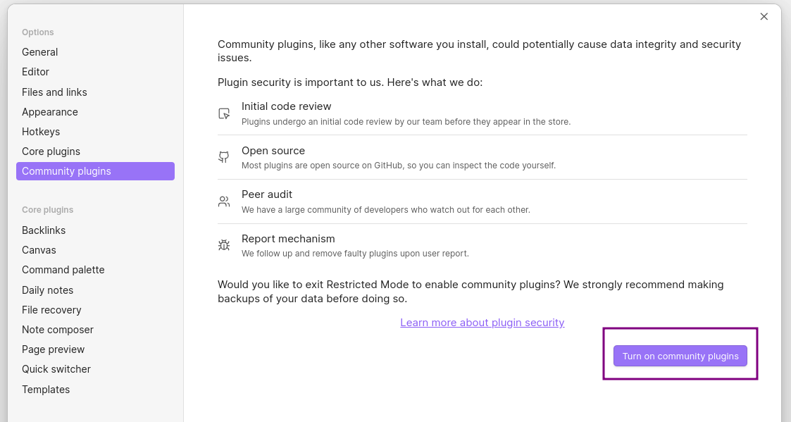
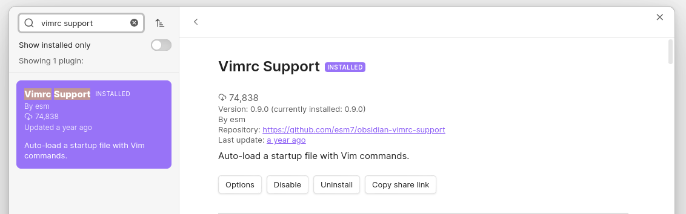

## Enhanced Vim mode in Obsidian 

Obsidian is shipped with Vim keybindings support, but it's not perfect. I noticed some annoyances while using it, so I decided to improve it a little bit

This repository contains some adjustments (defined in `app-adjustments.json` and `hotkeys-adjustments.json`), `.obsidian.vimrc` file (with some additional hotkeys and configuration), and `vimify.sh` script (for adding these modifications to an Obsidian Vault)

### Setup

1. Make sure that `jq` is available on your system
2. Make sure that community plugins are turned on (in your Vault's Settings)

3. Install and enable [Vimrc Support](https://github.com/esm7/obsidian-vimrc-support) plugin (clicking [this link](obsidian://show-plugin?id=obsidian-vimrc-support) should open the plugin in your Obsidian)

4. Clone the repo
5. Run `vimify.sh` script with path to your vault as the first argument:

```bash
./vimify.sh "/home/arek/.config/obsidian/Obsidian Sandbox"
```

6. Restart your Obsidian

#### Additional setup

1. If you like relative line numbers, install [Relative Line Numbers](https://github.com/nadavspi/obsidian-relative-line-numbers) plugin ([Obsidian link](obsidian://show-plugin?id=obsidian-relative-line-numbers))


#### More about the script

The script makes copies of the files (`app.json`, `hotkeys.json` and `.obsidian.vimrc`) before modifying them!

You can easily revert them back. For example:

```bash
cp \
  "<path-to-vault-directory>/.obsidian/app.json-2024-06-11T15:18:46UTC.bak"
  "<path-to-vault-directory>/.obsidian/app.json"
```

### Hotkeys

Changes within the default hotkeys:

| Command           |                         | Default hotkey | New hotkey | Comment                           |
| ----------------- | ----------------------- | -------------- | ---------- | --------------------------------- |
| Close Current Tab | workspace:close         | Ctrl+w         | Ctrl+q     | Ctrl+w can be used to delete word |
| Delete Paragraph  | editor:delete-paragraph | Ctrl+d         |            | Ctrl+d can be used to jump down   |

Additional hotkeys defined in `.obsidian.vimrc`:

| Action                 | Hotkey | Comment                                      |
| ---------------------- | ------ | -------------------------------------------- |
| Open Previous Tab      | gT     | Default in Vim                               |
| Open Previous Tab      | J      | Hotkey in Vimium browser extension           |
| Open Next Tab          | gt     | Default in Vim                               |
| Open Next Tab          | H      | Hotkey in Vimium browser extension           |
| Navigate Back          | Alt+h  |                                              |
| Navigate Forward       | Alt+l  |                                              |
| Close and Save         | ZZ     | Default in Vim                               |
| Open File Explorer     | ff     |                                              |
| Follow Link            | gd     | Often used as Go to Definition in Vim setups |
| Follow Link in New Tab | gD     | Often used as Go to Definition in Vim setups |
| Follow Link in Split   | gS     |                                              |
| Open New Tab           | t      | Hotkey in Vimium browser extension           |

### Additional configuration

`.obsidian.vimrc` additionally sets up:
- Yanking to system clipboard with `y` (by setting clipboard to `unnamedplus`)
